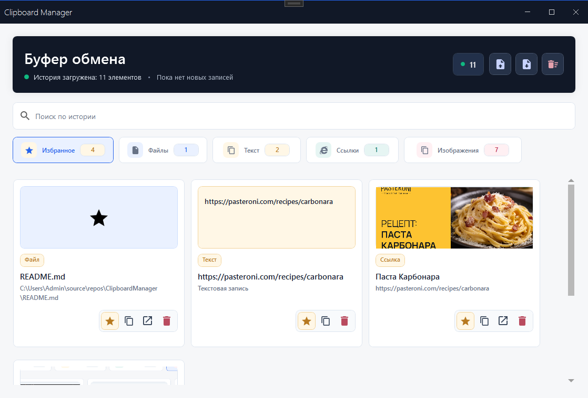
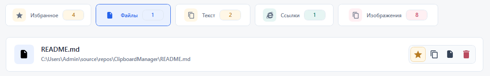
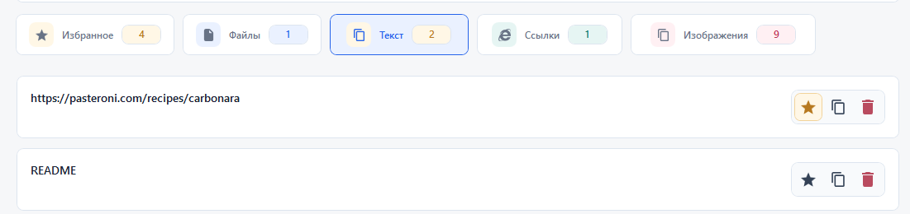
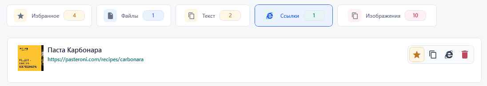
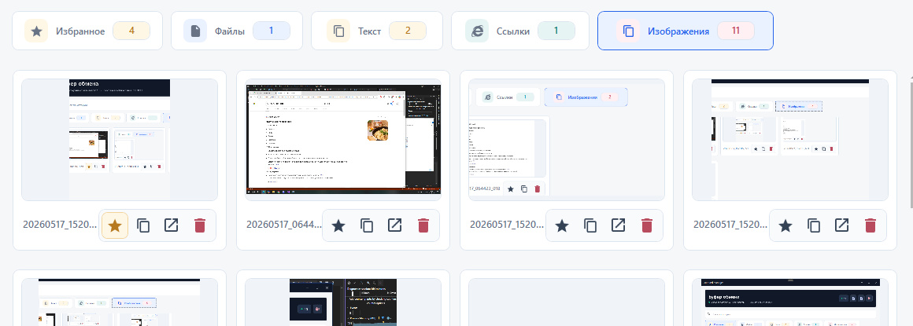
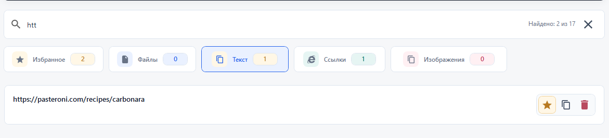

# ClipboardManager


ClipboardManager is a modern Windows clipboard history app built with WPF. It watches clipboard changes in real time, neatly separates copied content into files, text, links, images, and favorites, then stores the history locally in SQLite so useful snippets do not disappear after the next copy.

The app is designed as a quiet productivity tool: fast search, one-click copy back to clipboard, pinned items, rich link cards, image preview with zoom, and JSON backup/import are all available from a clean MahApps.Metro interface.

## Highlights

- Real-time clipboard monitoring through the native Windows clipboard listener.
- Separate sections for files, text fragments, URLs, images, and pinned favorites.
- Local SQLite persistence in `%LOCALAPPDATA%\ClipboardManager\clipboardDatabase.sqlite`.
- Smart URL cards with title, description, and Open Graph image when metadata is available.
- Image gallery with fullscreen-style preview, zoom controls, mouse-wheel zoom, and copy back to clipboard.
- Global search across saved files, texts, links, images, and favorites.
- Pin/unpin support for important items.
- Import and export through `.clipboard.json` backup files.
- Duplicate protection for copied files, texts, URLs, and images.
- Copy, open, delete, clear, import, and export actions from the UI.

## Screenshots

### Overview



### Main Sections

| Files | Text |
| --- | --- |
|  |  |

| Links | Images |
| --- | --- |
|  |  |

### Search



## Tech Stack

| Area | Technology |
| --- | --- |
| UI | WPF, XAML, MahApps.Metro, MahApps.Metro.IconPacks |
| Runtime | .NET 10, Windows 10 1903+ target |
| Architecture | MVVM-style ViewModel, services, repository layer |
| Storage | Entity Framework Core + SQLite |
| Link previews | HtmlAgilityPack + `HttpClient` |
| Clipboard access | WPF Clipboard API + native `WM_CLIPBOARDUPDATE` listener |

## Getting Started

### Requirements

- Windows 10 version 1903 or newer.
- .NET 10 SDK.
- Visual Studio with the .NET desktop development workload, JetBrains Rider, or another WPF-capable IDE.

### Run From Source

```powershell
git clone https://github.com/SerzLV/ClipboardManager.git
cd ClipboardManager
dotnet restore
dotnet run --project .\ClipboardManager\ClipboardManager.csproj
```

### Build

```powershell
dotnet build .\ClipboardManager.sln -c Release
```

The release output is generated under:

```text
ClipboardManager\bin\Release\net10.0-windows10.0.18362.0\
```

## How It Works

1. `ClipboardWatcher` subscribes the main window to Windows clipboard update events.
2. `WpfClipboardService` reads the current clipboard snapshot and identifies whether it contains files, text, an image, or URLs inside copied text.
3. `MainWindowViewModel` deduplicates new entries, updates the visible collections, refreshes search/favorite views, and triggers persistence.
4. `ClipboardRepository` stores the history in a local SQLite database and keeps the schema ready on startup.
5. `ClipboardTransferService` exports/imports history as readable JSON backup files.

## Project Structure

```text
ClipboardManager/
├── Data/                 SQLite DbContext and repository
├── Helper/               MVVM helpers, clipboard watcher, WPF behaviors
├── Models/               Clipboard item models
├── Resources/Images/     App image assets
├── Services/             Clipboard, shell, metadata, import/export services
├── ViewModel/            Main application state and commands
├── App.xaml              Application resources
├── MainWindow.xaml       Main UI layout and styles
└── ClipboardManager.csproj
```

## Data And Privacy

ClipboardManager stores clipboard history locally on your machine. It does not use cloud sync.

Because clipboard history can include sensitive data, review saved entries regularly and use the clear/delete actions when needed. URL previews may request metadata from copied web pages in order to display titles, descriptions, and preview images.

## Backup Format

Exports are saved as `.clipboard.json` files with:

- app export version and timestamp;
- file paths and names;
- text snippets;
- image bytes;
- URL metadata;
- pinned/favorite state.

Import merges data into the current history and avoids obvious duplicates.

## Roadmap Ideas

- Tray mode with background monitoring.
- Settings screen for history limits and startup behavior.
- Optional hotkeys for opening the app and pasting favorites.
- Automated tests for import/export and repository behavior.
- Packaged installer or GitHub Releases build pipeline.

## Disclaimer

This application is provided as-is, without warranty or guarantees. Use it at your own risk. See [LICENSE](LICENSE) for the full disclaimer.

## Support

If this project helped you, you can support the author:

<a href="https://www.buymeacoffee.com/serzlv" target="_blank"></a>
