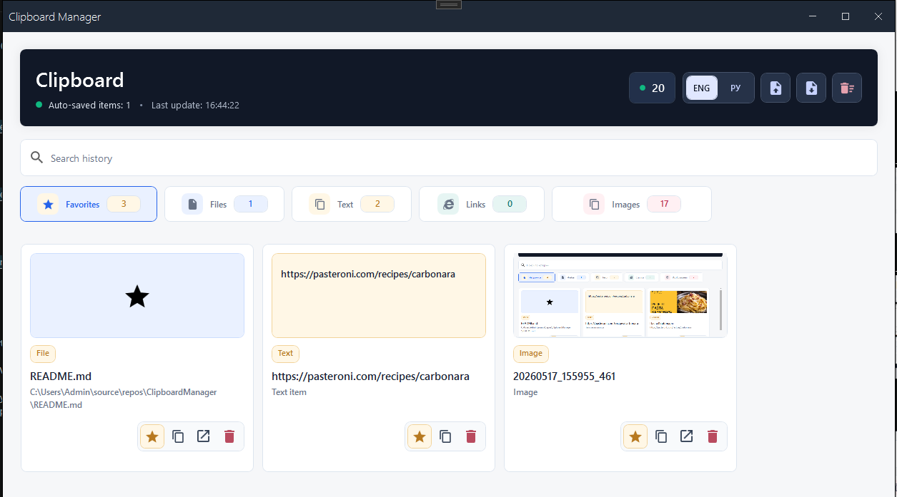
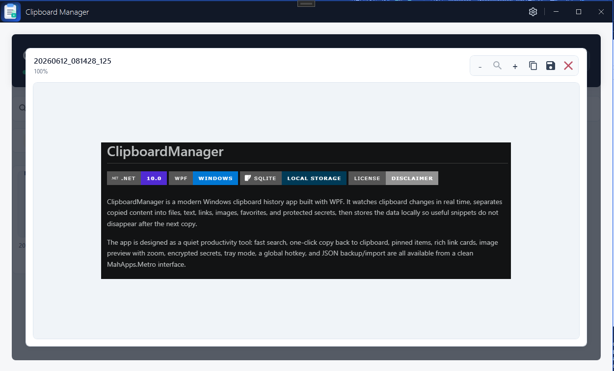
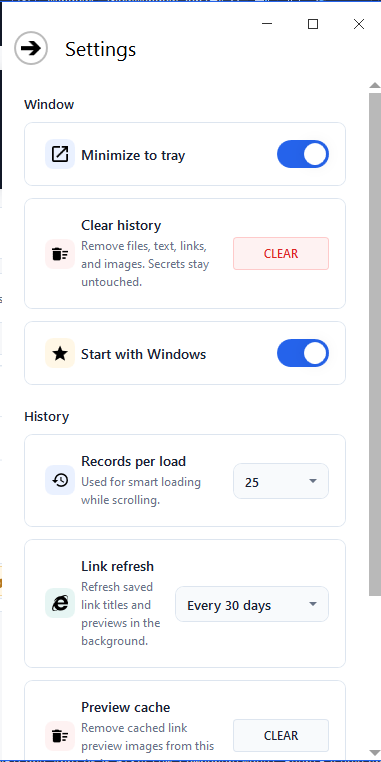

# ClipboardManager


ClipboardManager is a modern Windows clipboard history app built with WPF. It watches clipboard changes in real time, separates copied content into files, text, links, images, favorites, and protected secrets, then stores the data locally so useful snippets do not disappear after the next copy.

The app is designed as a quiet productivity tool: fast search, one-click copy back to clipboard, pinned items, rich cached link cards, image preview with zoom and save-to-file, encrypted secrets, tray mode, a global hotkey, and JSON backup/import are all available from a clean MahApps.Metro interface.

## Highlights

- Real-time clipboard monitoring through the native Windows clipboard listener.
- Separate sections for favorites, secrets, files, text fragments, URLs, and images.
- Local SQLite persistence in `%LOCALAPPDATA%\ClipboardManager\clipboardDatabase.sqlite`.
- Protected secrets encrypted with Windows DPAPI for the current user.
- Windows verification before revealing or copying a secret, with Windows Hello/PIN support and a password fallback.
- 30-second trusted copy window after successful secret verification.
- Secret values auto-hide after 30 seconds and copied secrets are cleared from the clipboard after 45 seconds when still unchanged.
- Smart URL cards with title, description, and Open Graph image when metadata is available.
- Cached link preview images stored locally, so repeated app launches do not re-download every preview.
- Background stale-link refresh with configurable intervals: never, every 7 days, or every 30 days.
- Link refresh is capped per run and uses stale-while-revalidate behavior: old data appears immediately, newer metadata updates quietly in the background.
- Image gallery with fullscreen-style preview, zoom controls, mouse-wheel zoom, and copy back to clipboard.
- Save images from the gallery, favorites, or image preview as PNG, JPG, or BMP.
- Global search across saved files, texts, links, images, secrets, and favorites.
- Smart lazy loading for large histories, with a configurable number of records loaded per scroll batch.
- Pin/unpin support for important items, including secrets.
- Tray mode with open/exit menu and minimize-to-tray behavior.
- Optional Windows startup launch using the current user's Run registry key.
- Optional global hotkey `Ctrl+Alt+V` to open or minimize the app.
- Single-instance launch guard: opening the EXE again activates the existing window instead of starting another process.
- Import and export through `.clipboard.json` backup files.
- Duplicate protection for copied files, texts, URLs, and images.
- Copy, open, delete, import, export, and save-as-secret actions from the UI.
- Settings panel for tray behavior, Windows startup, history batch size, link refresh interval, preview cache cleanup, clear history, and hotkey toggle.
- Supports ENG/РУ languages.

## Screenshots

### Overview



### Image Preview



### Settings



## Tech Stack

| Area | Technology |
| --- | --- |
| UI | WPF, XAML, MahApps.Metro, MahApps.Metro.IconPacks |
| Runtime | .NET 10, Windows 10 1903+ target |
| Architecture | MVVM, dependency injection, service interfaces, repository layer, extracted views/resources |
| Storage | Entity Framework Core + SQLite |
| Link previews | HtmlAgilityPack + `HttpClient` |
| Clipboard access | WPF Clipboard API + native `WM_CLIPBOARDUPDATE` listener |
| Windows integration | Tray icon, Windows startup setting, single-instance guard, global hotkey, Windows credential prompt |
| Secret storage | Windows DPAPI with `DataProtectionScope.CurrentUser` |

## Getting Started

### Requirements

- Windows 10 version 1903 or newer.
- .NET 10 SDK.
- Visual Studio with the .NET desktop development workload, JetBrains Rider, or another WPF-capable IDE.

### Run From Source

```powershell
git clone https://github.com/SerzLV/ClipboardManager.git
cd ClipboardManager
dotnet restore
dotnet run --project .\ClipboardManager\ClipboardManager.csproj
```

### Build

```powershell
dotnet build .\ClipboardManager.sln -c Release
```

The release output is generated under:

```text
ClipboardManager\bin\Release\net10.0-windows10.0.18362.0\
```

## How It Works

1. `ClipboardWatcher` subscribes the main window to Windows clipboard update events.
2. `WpfClipboardService` reads the current clipboard snapshot and identifies whether it contains files, text, an image, or URLs inside copied text.
3. `MainWindowViewModel` coordinates commands and visible state, while focused services handle capture, persistence, metadata, images, transfer, shell integration, and secret protection.
4. `ClipboardRepository` stores the history and encrypted secrets in a local SQLite database and keeps the schema ready on startup.
5. `DpapiSecretProtectionService` encrypts secret values for the current Windows user.
6. `WindowsUserConsentService` asks Windows to verify the user before protected secret actions.
7. `LinkMetadataRefreshService` refreshes stale saved link metadata in small background batches.
8. `LinkPreviewImageService` loads preview images through a local cache before attempting network downloads.
9. `ClipboardTransferService` exports/imports non-secret history as readable JSON backup files.
10. `MainWindow` owns shell-level behavior such as tray mode, minimize-to-tray, single-instance activation, Windows startup registration, and the global open/minimize hotkey.

## Project Structure

```text
ClipboardManager/
├── Data/                 SQLite DbContext and repository
├── Helper/               MVVM helpers, clipboard watcher, WPF behaviors
├── Interfaces/           Service and repository contracts
├── Localization/         English/Russian UI resources and app settings storage
├── Models/               Clipboard item models
├── Resources/            XAML resources, localized strings, image assets
├── Services/             Clipboard, shell, metadata, cache, import/export services
├── ViewModel/            Main application state, commands, partial feature areas
├── Views/                Extracted WPF views for header, settings, image preview
├── App.xaml              Application resources
├── MainWindow.xaml       Main UI shell
└── ClipboardManager.csproj
```

## Data And Privacy

ClipboardManager stores clipboard history locally on your machine. It does not use cloud sync.

Regular history is stored in SQLite under `%LOCALAPPDATA%\ClipboardManager`. Link preview images are cached under `%LOCALAPPDATA%\ClipboardManager\Cache\LinkPreviews`. App preferences are stored in `%APPDATA%\ClipboardManager\settings.json`. The Windows startup setting is applied per-user through `HKCU\Software\Microsoft\Windows\CurrentVersion\Run`.

Secrets are stored in the same local database, but the secret value is encrypted with Windows DPAPI and scoped to the current Windows user. The UI shows secrets masked by default, asks Windows to verify the user before reveal/copy, auto-hides revealed values, and clears copied secrets from the clipboard after a short delay when possible.

Exports intentionally do not include secrets. The "clear history" action clears regular clipboard history but keeps secrets separate; delete a secret directly when it should be removed.

Because clipboard history can include sensitive data, review saved entries regularly and use the clear/delete actions when needed. URL previews may request metadata from copied web pages in order to display titles, descriptions, and preview images. Existing link cards are shown from local data first; background refresh only checks stale records according to the configured interval.

## Backup Format

Exports are saved as `.clipboard.json` files with:

- app export version and timestamp;
- file paths and names;
- text snippets;
- image bytes;
- URL metadata and metadata refresh timestamp;
- pinned/favorite state.

Secrets are excluded from backup files by design.

Import merges data into the current history and avoids obvious duplicates.

## Roadmap Ideas

- Configurable hotkey selection instead of a fixed `Ctrl+Alt+V`.
- History retention rules and cleanup policies.
- Optional quick-paste actions for favorites.
- Automated tests for import/export and repository behavior.
- Packaged installer or GitHub Releases build pipeline.

## Disclaimer

This application is provided as-is, without warranty or guarantees. Use it at your own risk. See [LICENSE](LICENSE) for the full disclaimer.

## Support

If this project helped you, you can support the author:

<a href="https://www.buymeacoffee.com/serzlv" target="_blank"></a>
