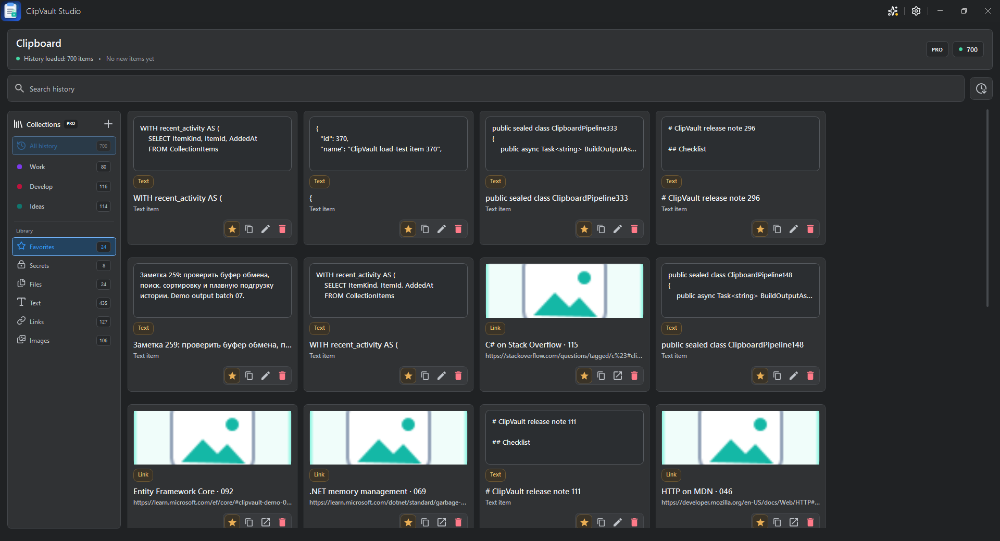
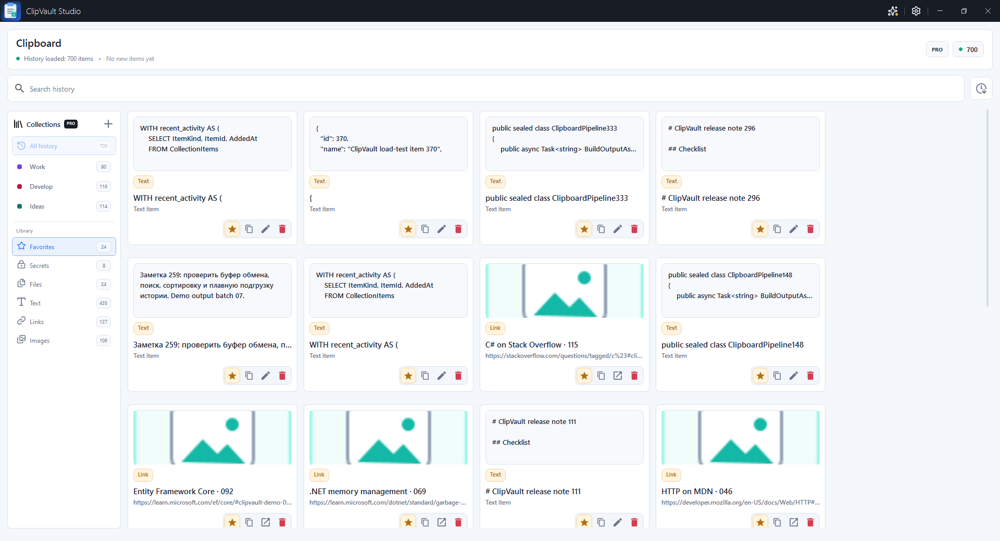
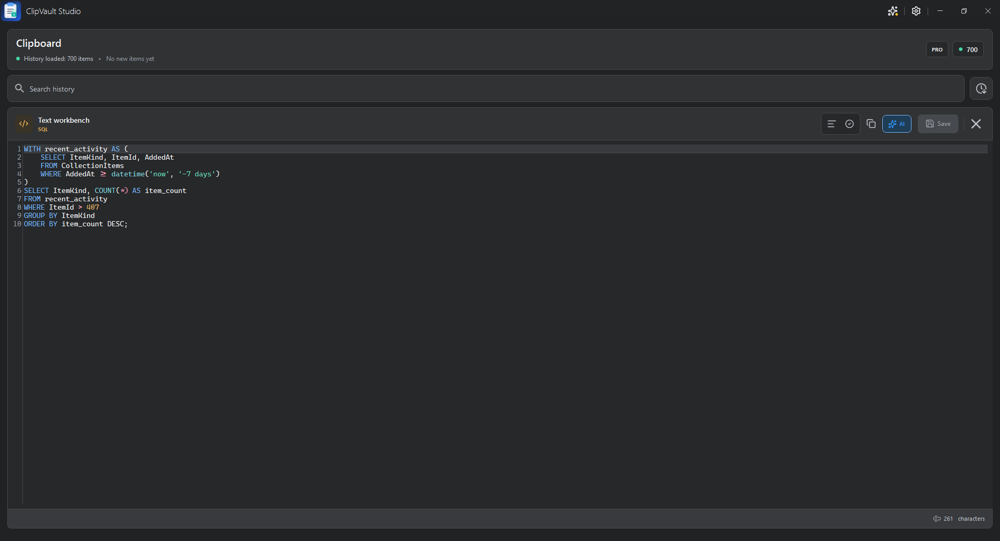
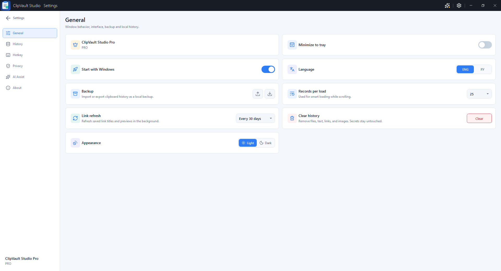

# ClipVault Studio

[Get ClipVault Studio from Microsoft Store](https://apps.microsoft.com/detail/9N7B9J7F81WF)

ClipVault Studio is a private Windows clipboard workspace for people who work
with text, links, screenshots, images, and file references throughout the day.
It keeps clipboard history on the device, provides complete-history search,
adds keyboard-first Quick Paste, and offers optional Pro tools for organization,
structured text, file preview, image annotation, text comparison, and local AI
assistance.

This public repository is the official **documentation and support portal** for
ClipVault Studio. Application source code and build infrastructure are not
published here.

Current version: **2.1.5** (Microsoft Store package `2.1.5.0`).

## Editions

### Free

- Clipboard history for files, text, links, and images.
- Favorites, a protected Secret Vault, and Recovery Kit support.
- Complete-history search, sorting, incremental loading, and multi-select cleanup.
- Quick Paste palette for recent and searched text, links, files, and images.
- Link cards and local preview caching.
- Image preview, descriptions, search, copy, and save.
- Tray mode, Windows startup, configurable app and Quick Paste hotkeys,
  readable JSON backup, and password-protected backup/import.
- Light and dark themes with English and Russian localization.

## Quick Paste

Quick Paste opens a compact mixed-history palette over the application you
were using:

- press the configurable Quick Paste hotkey to see recent clipboard items;
- type to search the complete local history;
- press `Enter` to paste into the previously active application;
- press `Ctrl+Enter` to copy without pasting;
- press `Escape` to clear the query, then again to close the palette.

Protected secrets never appear in Quick Paste. Before pasting, ClipVault Studio
revalidates the destination window and owning process. If Windows blocks focus
restoration or synthetic input, the item remains copied and the app reports a
copy-only fallback instead of pasting into an unrelated window.

## Protected Secrets And Backups

Before a Secret Vault is configured, Secret values are protected for the
current Windows user and access uses Windows verification. The optional vault
adds a master password, a Recovery Kit, explicit lock/unlock controls, and
automatic key expiry after 30 seconds. The master password is never stored.

Standard `.clipboard.json` exports remain readable and always exclude Secrets.
A password-protected `.cvbackup` encrypts the complete backup and can optionally
include Secrets after the vault is unlocked. Its password is independent from
the vault master password and cannot be recovered by ClipVault Studio.

The current `.cvrecovery` file can reset a forgotten vault password only while
the matching local vault state remains available. It is sensitive access
material, not a database backup. Creating a replacement Recovery Kit
invalidates the previous one.

### Pro

Eligible users can evaluate Pro with a one-time seven-day local trial. Pro can
then be unlocked through Microsoft Store with a monthly subscription or a
one-time Lifetime purchase.

Pro adds:

- Collections with mixed item types, context actions, and drag-and-drop.
- Smart text categories and exact format filters.
- Structured editors and previews for JSON, Markdown, SQL, XML, CSS/SCSS,
  YAML, HTML, and common programming languages.
- Read-only preview for supported text-based files.
- Local Text Compare with aligned line and word differences, search, change
  navigation, synchronized scrolling, a minimap, collapsible unchanged
  regions, word wrap, and movable splitters.
- Quick image annotation with text, highlights, shapes, arrows, colors,
  opacity, and save-as-copy.
- Optional local AI Assist for generation, rewriting, summarization,
  translation, and explanation of text or code.

Trial expiration returns the application to Free without deleting regular
clipboard history or user-created data. Microsoft Store handles subscription
renewal, cancellation, Lifetime ownership, purchase restoration, regional
availability, and payment processing.

## Privacy

Clipboard history is stored locally. ClipVault Studio does not use cloud
synchronization, advertising, publisher-operated analytics, or
publisher-operated telemetry.

Network access is limited to user-visible features such as:

- loading metadata and preview images for copied public links;
- downloading the optional Qwen model after explicit user confirmation;
- Microsoft Store licensing and purchase flows handled by Windows.

The optional AI model is not included in the Store package. AI inference runs
locally on the CPU through LLamaSharp. Saved prompts and optional AI response
history are encrypted on the device. The model can be installed in a
user-selected folder, including paths containing Unicode or Cyrillic
characters. Model updates are checked manually and are downloaded only after
the user reviews and confirms the signed release.

Read the complete [Privacy Notice](PRIVACY.md).

## About And Diagnostics

**Settings > About** shows the installed version and active edition and provides
direct access to Microsoft Store, the user guide, privacy notice, support, and
the third-party notices shipped with the app.

**Settings > Diagnostics** provides a bounded local crash log and a sanitized
support-summary workflow. Logs are never uploaded automatically.

## Screenshots

### Dark Theme



### Light Theme



### Pro Text Workbench



### Settings



## Documentation

- [User Guide](docs/USER_GUIDE.md)
- [Privacy Notice](PRIVACY.md)
- [Support and Troubleshooting](SUPPORT.md)
- [Security Policy](SECURITY.md)
- [Disclaimer](DISCLAIMER.md)
- [Release Notes](RELEASE_NOTES.md)
- [Open-Source Components and Qwen Model](docs/OPEN_SOURCE.md)
- [Third-Party Notices](THIRD-PARTY-NOTICES.txt)

## Local Data

Depending on the features used, ClipVault Studio can create data in:

```text
%LOCALAPPDATA%\ClipboardManager\clipboardDatabase.sqlite
%LOCALAPPDATA%\ClipboardManager\Secrets\vault-state.json
%LOCALAPPDATA%\ClipboardManager\Cache\LinkPreviews
%LOCALAPPDATA%\ClipboardManager\AI\ai-assistant.sqlite
%LOCALAPPDATA%\ClipboardManager\Models
%LOCALAPPDATA%\ClipboardManager\Logs\crash.log
%LOCALAPPDATA%\ClipboardManager\Logs\crash.previous.log
%APPDATA%\ClipboardManager\settings.json
```

The Secret Vault metadata file is created only after vault setup and does not
contain the master password or plaintext Secret values. The AI database and
Models folder are created only when the related Pro features are used.
Diagnostic logs are bounded and are never uploaded automatically.

Standard JSON exports contain regular clipboard history and never contain
Secrets. Protected `.cvbackup` files contain the same history and can optionally
include Secrets. Neither format contains collections, AI prompts or history,
settings, model files, trial state, or Microsoft Store entitlement data.

## Download

Microsoft Store is the official distribution channel and provides automatic
updates, trial eligibility, and paid entitlement restoration:

[Download ClipVault Studio](https://apps.microsoft.com/detail/9N7B9J7F81WF)

This repository does not distribute installers, portable builds, application
packages, or source archives.

## Support

- Email: clipboardmanager.app@outlook.com
- Issues: [SerzLV/ClipboardManager issues](https://github.com/SerzLV/ClipboardManager/issues)
- Reporting guide: [SUPPORT.md](SUPPORT.md)

Do not include clipboard contents, passwords, tokens, Recovery Kits, protected
backups, private documents, database files, AI history, or other sensitive data
in public issues.
